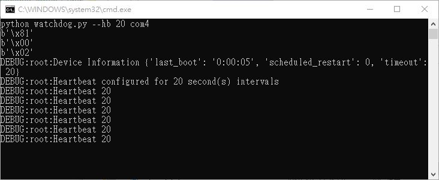

## python code was broken and missing proc/uptime, my fix, then it is really open source code
fix that and change some code to be able to work

run win10 python3
add run.bat
```
:: xiaolaba, 2021-08-19
:: no clone, download zip from https://github.com/zatarra/usb-watchdog
:: upzip, change folder name

cd "c:\usb-watchdog-master\usb-watchdog"

::hb = heart beat 2 *10 seconds
python watchdog.py --hb 20 com4

pause

```


```
    def _read(self, byte):
        try:
            self._write(byte)
            a = self.watchdog.read()    ## xiaolaba, corrected the code to be able to run
```


def get_info(self):  
add following to test the serial write and read command protocol  
every time this python code runing, reset the usbwatchdog  
change code open ./proc/uptime
```
        with open('./proc/uptime', mode='r') as f:

        self._write(0x80)   ## init, usbwatchdog reply 0x81, 0x00, 0x02 (version 2) or 0x03 (version 3)
        self._write(0xe3)
        self._write(0x00)
        
        self._read(0x80)
        self._read(0xe3)
        self._read(0x00)
                        
        self._write(0xff)   ##reset

```


this is my test screen  


   
   
   
   


# usb-watchdog
[Original blogpost](http://www.davidgouveia.net/2018/02/how-to-create-your-own-script-for-a-usb-watchdog/)

## What is it?
Python script to allow you to control a usb watchdog

## How does it work?
These usb watchdogs that are available on ebay/aliexpress create a virtual serial port ( just like arduinos ) and they expect a heartbeat generated by some software. If that heartbeat is not received within a certain timeframe it will trigger its relays to shutdown and reset the computer. I've sniffed the serial port to reverse engineer the protocol which seems quite simple:

- The USB watchdog expects you to send a number based on the corresponding ascii code. This number is the heartbeat threshold. 
- Thresholds are defined by numbers multiplied by 10. E.g. if you want to define a 10 second threshold for the heartbeat you should should send the ascii char that is equal to 1. For a 30 second threshold you should send the ascii char that is equal to 3.
- Encode a character using its integer value as reference.
- Sending char(255) forces a reset. 
- Sending char(128) returns information regarding status and firmware version (I'm too lazy to reverse this)

Everytime you send a heartbeat the usb watchdog saves its value and starts using it as reference. This means that if you want to change the threshold to 180 seconds, all you have to do is send a heartbeat the the ascii value that is equal to decimal 18. 
## Caveats

- Avoid using very small thresholds. The last value that you sent to the usb watchdog will be used onwards. 
This means that if you set a threshold of 10 seconds and for some reason your computer gets reset you will then have 10 seconds to complete the boot process and start running this script again otherwise you might end up stuck in a loop.


## Buy me a beer
If you find this script useful, buying me a beer would be much appreciated :)
```
*bitcoin:* 3Mj3v5hrx5qQhwzzWPMGwkJ8DRMCywhZFy
*bitcoin cash:* 1KDbjLM9DdsCyfDMSYHdm52r5R3BRP2dfS
*ethereum:* 0xfF7167e9ea8A4d882dd9161FC5F1560B9031A6c6
*litecoin:* MERSbMVM9NmQoDhr5ktswpaumWk8dGbyUu
*ripple:* rN1sXzZUBej2wiZSjgKtAgNRTUoFhUdt36 
*stellar:* GBYS4JGPYZI774ZIU3KNEKSDUK2E3VMXQO4AZTHAO7WU4EZRSG7QF5MG
```
